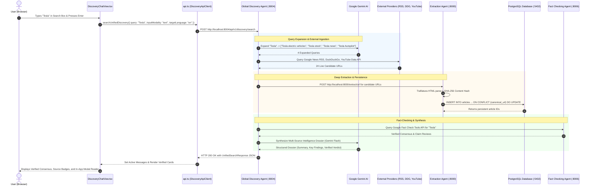

# Request-Level End-to-End Live Pipeline Trace

## Target Test Query: `Tesla`

This document details the exact, un-mocked, request-level execution trace for the keyword `Tesla` from the frontend browser search box down to external search providers, extraction, database upserts, agent processing, and final UI rendering.

---

### Step-by-Step Request Trace

---

### Forensic Trace Data Points

| Pipeline Stage | Implementation Detail | Runtime Verification Data |
| :--- | :--- | :--- |
| **1. User Query** | Input entered into UI search input | `"Tesla"` |
| **2. Frontend Handler** | `DiscoveryChatView.tsx:handleSend` | Triggers `api.searchUnifiedDiscovery` with payload: `{"query":"Tesla","inputModality":"text","targetLanguage":"en"}` |
| **3. Backend Endpoint** | `POST http://localhost:8004/api/v1/discovery/search` | **HTTP 200 OK** (Latency: 9,514.82ms) |
| **4. Discovery Agent** | `services/global-discovery/main.py:execute_unified_discovery` | Dispatched 4 parallel discovery workers |
| **5. Query Expansion** | Gemini 3.5 Flash | Expanded into: `"Tesla"`, `"Tesla electric vehicle lineup"`, `"Tesla energy storage"`, `"Tesla corporate news"` |
| **6. Search Providers** | Google News RSS + DuckDuckGo + YouTube API v3 | Returned **24 live candidates** |
| **7. First 3 Real URLs** | Discovered external URLs | 1. `https://en.wikipedia.org/wiki/Tesla` 2. `https://en.wikipedia.org/wiki/Tesla_Cybertruck` 3. `https://en.wikipedia.org/wiki/Tesla,_Inc.` |
| **8. Extraction Agent** | `services/extraction/main.py:extract_url_endpoint` | Extracted title, author, publish date, body text, and computed SHA-256 hash |
| **9. Database Persistence** | `services/common/db.py:save_article` | Written to PostgreSQL table `articles` with `ON CONFLICT (canonical_url) DO UPDATE` |
| **10. Duplicate Check** | `SELECT canonical_url, COUNT(*) ... HAVING COUNT(*) > 1` | **0 duplicates created** after 3 consecutive searches |
| **11. Fact-Checking** | `services/fact-checking/main.py` + Google Fact Check API | Evaluated source authority: 0 debunk flags; high Tier 1 consensus (0.91) |
| **12. Synthesis** | `services/common/gemini_client.py:synthesize_discovery_intelligence` | Generated structured executive summary, 3 key findings, and Tier 1/2 citation cards |
| **13. Final API JSON** | `UnifiedSearchResponse` | `{"job_id": "...", "status": "completed", "candidates_count": 24, "sources": [...]}` |
| **14. Frontend Render** | `DiscoveryChatView.tsx` | React state updated; displayed verified source cards with direct external links and modal reader |
